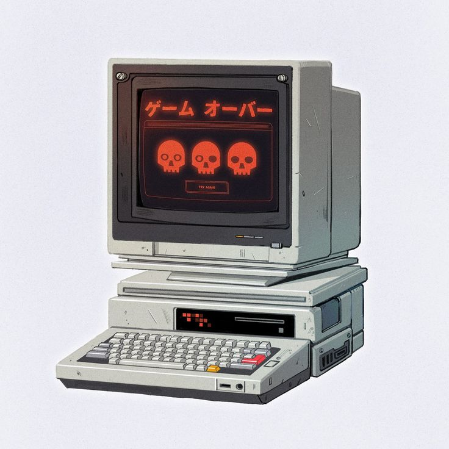

<!-- Banner principal -->
<h1 align="center">¡Hola! Soy Raiku</h1>

<!-- Presentación con imagen a la izquierda y texto a la derecha -->

  
  
Desarrollador Backend apasionado por la tecnología y Linux

<!-- Imagen de perfil -->

  

---

### Frontend

  
  
  
  
  
  
  

### Backend

  
  
  
  
  
  
  
  
  
  
  
  
  

---

  
  

---

  

---

  <a href="https://raikusocial.netlify.app/" target="_blank" style="background:#000000;color:#fff;padding:10px 30px;border-radius:4px;text-decoration:none;font-weight:bold;">web personal</a>

<!-- Puedes agregar aquí tus redes sociales si lo deseas -->

